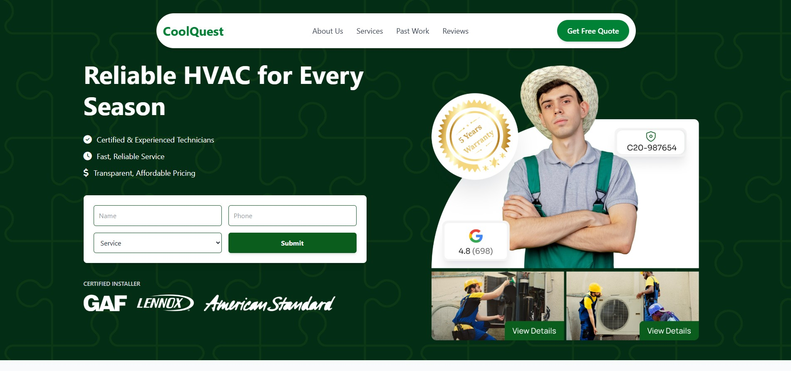

# ❄️ CoolQuest - Your HVAC Comfort Experts ☀️

## Project Overview

Welcome to the CoolQuest website repository! This project is a modern, responsive website designed for an HVAC (Heating, Ventilation, and Air Conditioning) service company. It showcases key services, customer testimonials, and provides an easy way for users to request a free quote.

This website was developed as part of my learning journey in the **MERN Batch 04 Complete Career Path** at **Interactive Cares**.

## Features

- **Clean and Responsive Design:** Optimized for various devices, from desktops to mobile phones.
- **Intuitive Navigation:** Easy-to-use menu for seamless Browse (with a sticky header for enhanced user experience).
- **Hero Section with Key Messaging:** Highlights the company's core value proposition: "Reliable HVAC for Every Season".
- **Service Request Form:** A prominent form for users to quickly submit their details and service needs.
- **Benefits Section:** Clearly outlines the advantages of choosing CoolQuest, such as "24/7 Emergency Services," "Experienced Professionals," and "Affordable Pricing".
- **Past Work Gallery:** Showcases successful HVAC projects, including "Efficient Home Heating Upgrade," "Emergency AC Repair & Restoration," and "Complete HVAC System Installation".
- **Customer Testimonials:** Features real family reviews, emphasizing trust and satisfaction.
- **Certification Display:** Highlights industry accreditations and partnerships (e.g., ISO certifications, EPA, BBB, NATE, GAF, Lennox, American Standard).

## Technologies Used

- **HTML5:** For structuring the web content.
- **CSS3:** For styling and visual presentation.
- **Tailwind CSS:** A utility-first CSS framework for rapid UI development, used extensively for styling components.
- **JavaScript:** For interactive elements (e.g., mobile menu toggle).
- **Git:** For version control.
- **VS Code:** The primary Integrated Development Environment (IDE) used for coding.
- **Adobe Photoshop:** Utilized for image editing and optimization for the web.

## 📚 What I Learned

Through this assignment, I learned how to Tailwind CSS and create website UI.

## 📅 Submission Date

**Submitted on:** 27 May 2025

## 🌐 Live Preview

👉 [coolquest](https:// /)

## 📸 Screenshot



---

## 🚀 Project Setup

To get a local copy up and running, follow these simple steps:

1.  **Clone the repository:**

    ```bash
    git clone https://github.com/mahadihk/ic-assignment-03
    ```

2.  **Navigate to the project directory:**

    ```bash
    cd ic-assignment-03
    ```

3.  **Open in your browser:**
    Simply open the `index.html` file in your preferred web browser.

## Assignment Details

- **Platform:** Interactive Cares
- **Course/Batch:** MERN Batch 04 Complete Career Path
- **Instructor:** Asief Mahir ([LinkedIn Profile](https://www.linkedin.com/in/asiefmahir/))
- **Deadline:** May 27, 2025
- **Submission Date:** May 27, 2025
